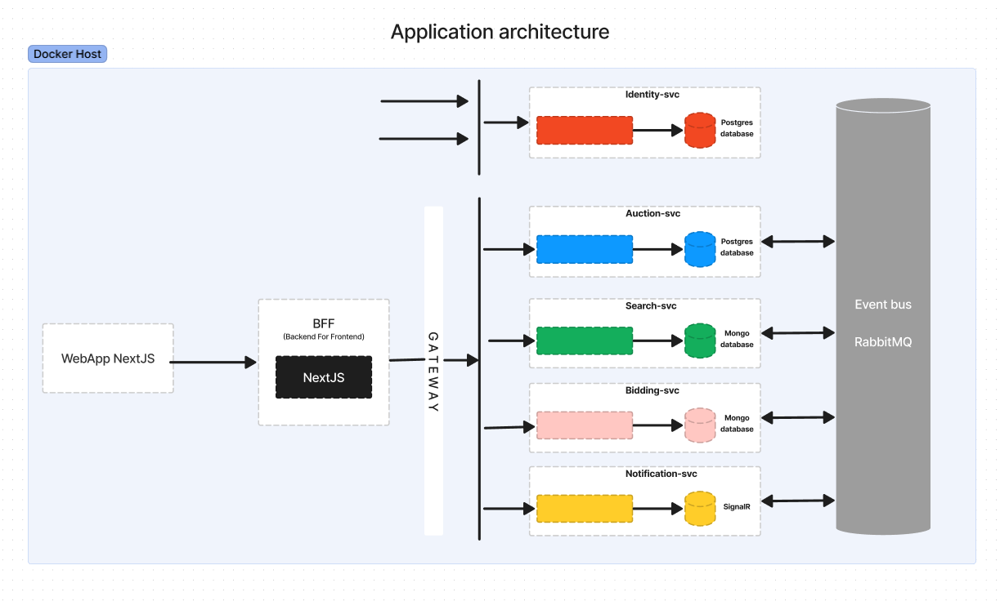

# Project: Auction App 

Microservices based web app. 

***

## About the project 
Microservices based web app. 
Live demo publication postponed. New release date October 13th!

## Technologies Used

- C# and .NET Core 7 for the backend
- Next.js for the client app
- Service to service communication using RabbitMQ and gRPC
- IdentityServer
- Docker
- Kubernetes cluster
- CI/CD workflows using GitHub actions

## Features

- Authentication (Register and Login)
- Live bidding
- Notifigations (eg. when new auction is published)
- Create new items for auction (when logged in)
- Delete and update your own items 
- Search for specifig item in auction
- Filter results
- Pagination 

## Application architecture

### Key points about the architecture

- Project utilizes [microservices architecture](https://learn.microsoft.com/en-us/azure/architecture/guide/architecture-styles/microservices)
- The identity service is a distinct component of the application architecture designed to avoid dependency on cloud services.
- The gateway is also a separate service that offers a single access point for client application to connect to backend services.

## Services

Below there is brief explanation what responsibilities each of the service has in part of the whole microservices project.

### Auction service

Basic web-API which primary purpose is to manage auctions for various items. It's responsible for handling the creation, management, and deletion of auctions for items. It communicates with other services through RabbitMQ and emits events to notify other components of important changes in auction status or item details.

**Infrastructure**
- .Net Web API
- Postgres DB
- Entity Framework ORM
- Service Bus - RabbitMQ

**API Endpoints**

| POST       | PUT          | DELETE       | GET           | GET               |
|------------|--------------|--------------|---------------|-------------------|
| api/auctions     | api/auctions/:id | api/auctions/:id | api/auctions | api/auctions/:id |
| Create Item | Update auction  | Delete auction  | Get auctions | Get auction by id |
| Auth       | Auth         | Auth         | Anon          | Anon              |

### Search service

Coming soon...

## How to run the project

Coming soon...

## Tests

Coming soon...

## Other notes

Complexity in this project is microservices architecture in itself. Every service has relatively simple codebase

## Helpful Links

> **Following material will help to understand this project and learn more about conscepts used in this project

- [Microservices architecture](https://learn.microsoft.com/en-us/azure/architecture/guide/architecture-styles/microservices)
- [NextJS](https://nextjs.org/)
